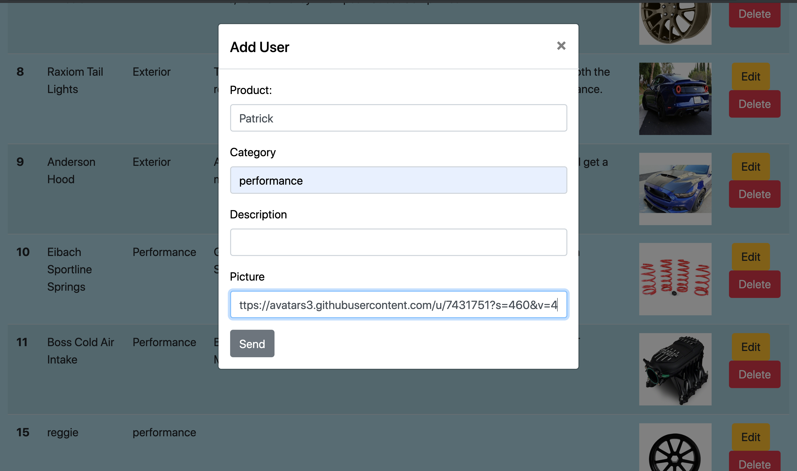
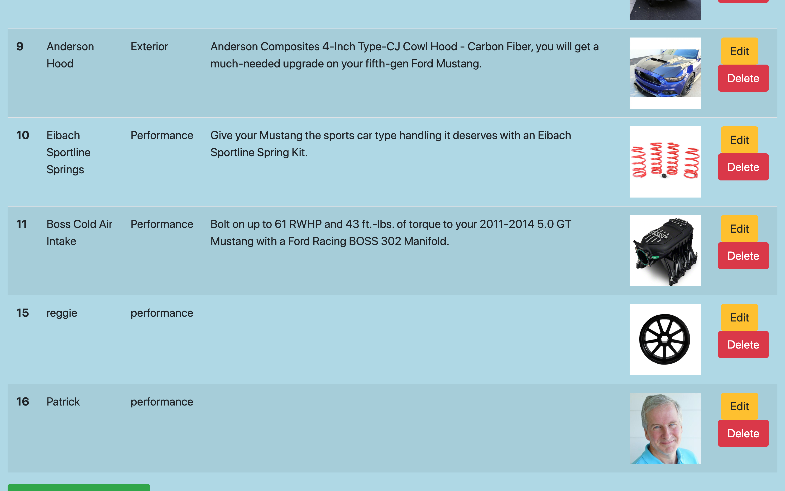
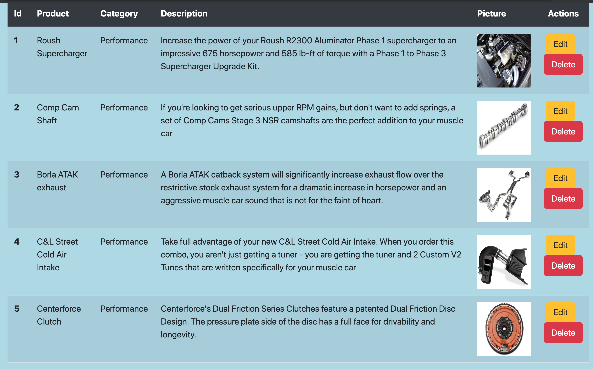
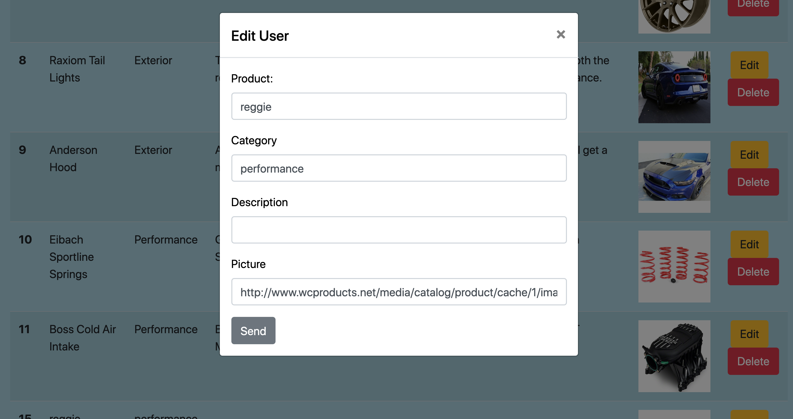
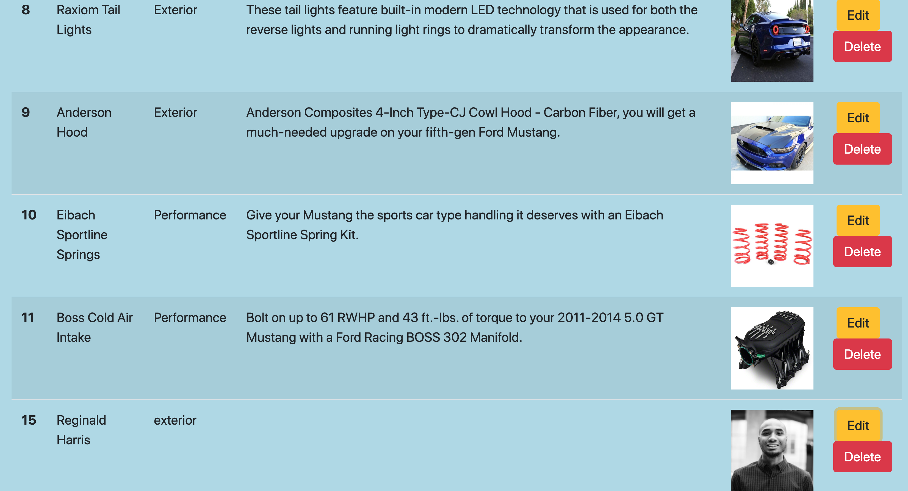
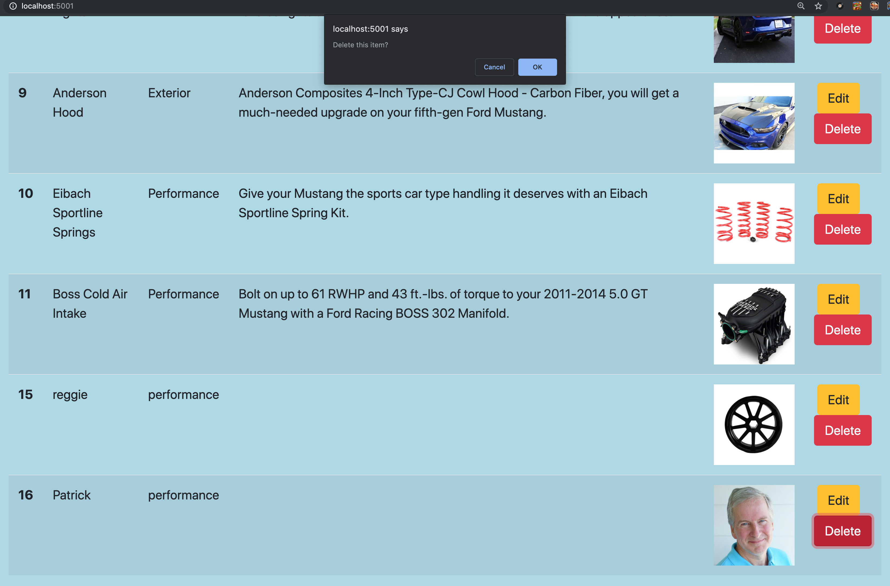

his project was bootstrapped with [Create React App](https://github.com/facebook/create-react-app).

### Purpose

This project is a challenge that connects a mysql database to a react UI using C#. From the react UI the user is able to perform all of the CRUD methods, Create, Read, Update, and Delete. These operations are done using the button on the right and bottom of the browser. Below is a demonstration of all of the CRUD commands being executed, Above each image is a brief description of a CRUD operation being executed.

### CRUD Examples

## ====CREATE=====

-- input box displayed when pressing add button at the bottom of the browser, fill out information to add a new product.

//////////////////////////////////////////////////////////////////////////////

--shows product "patrick" added to the products list.

//////////////////////////////////////////////////////////////////////////////

====READ====

//////////////////////////////////////////////////////////////////////////////

--displays all products in the product list

====UPDATE====

//////////////////////////////////////////////////////////////////////////////

--display edit box used for updating products, in the image product "reggie" with id of 15 is being changed.

//////////////////////////////////////////////////////////////////////////////

--displays the changed product "reginald harris" with a new image and category, note the same id is present.

//////////////////////////////////////////////////////////////////////////////

====DELETE====

--deleting the product "patrick" with delete button

//////////////////////////////////////////////////////////////////////////////

--shows deleted "patrick" product

## ClientApp/images/delete-part2.png

//////////////////////////////////////////////////////////////////////////////

### License and copyright

copyrighted by Reginald T. Harris, Road2Hire Program

## Available Scripts

In the project directory, you can run:

### `npm start`

Runs the app in the development mode. 
Open [http://localhost:5001](http://localhost:5001) to view it in the browser. Project is ran using concurrentlt npm package to start it. "npm start" will run the client and server simultaniously.

The page will reload if you make edits. 
You will also see any lint errors in the console.

### `npm test`

Launches the test runner in the interactive watch mode. 
See the section about [running tests](https://facebook.github.io/create-react-app/docs/running-tests) for more information.

### `npm run build`

Builds the app for production to the `build` folder. 
It correctly bundles React in production mode and optimizes the build for the best performance.

The build is minified and the filenames include the hashes. 
Your app is ready to be deployed!

See the section about [deployment](https://facebook.github.io/create-react-app/docs/deployment) for more information.

### `npm run eject`

**Note: this is a one-way operation. Once you `eject`, you can’t go back!**

If you aren’t satisfied with the build tool and configuration choices, you can `eject` at any time. This command will remove the single build dependency from your project.

Instead, it will copy all the configuration files and the transitive dependencies (Webpack, Babel, ESLint, etc) right into your project so you have full control over them. All of the commands except `eject` will still work, but they will point to the copied scripts so you can tweak them. At this point you’re on your own.

You don’t have to ever use `eject`. The curated feature set is suitable for small and middle deployments, and you shouldn’t feel obligated to use this feature. However we understand that this tool wouldn’t be useful if you couldn’t customize it when you are ready for it.

## Learn More

You can learn more in the [Create React App documentation](https://facebook.github.io/create-react-app/docs/getting-started).

To learn React, check out the [React documentation](https://reactjs.org/).

### Code Splitting

This section has moved here: https://facebook.github.io/create-react-app/docs/code-splitting

### Analyzing the Bundle Size

This section has moved here: https://facebook.github.io/create-react-app/docs/analyzing-the-bundle-size

### Making a Progressive Web App

This section has moved here: https://facebook.github.io/create-react-app/docs/making-a-progressive-web-app

### Advanced Configuration

This section has moved here: https://facebook.github.io/create-react-app/docs/advanced-configuration

### Deployment

This section has moved here: https://facebook.github.io/create-react-app/docs/deployment

### `npm run build` fails to minify

This section has moved here: https://facebook.github.io/create-react-app/docs/troubleshooting#npm-run-build-fails-to-minify
